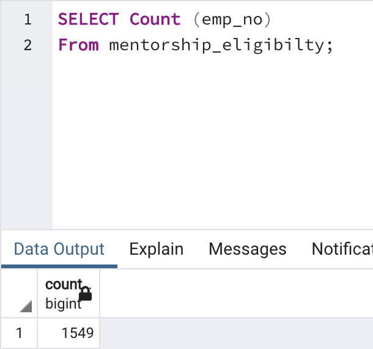
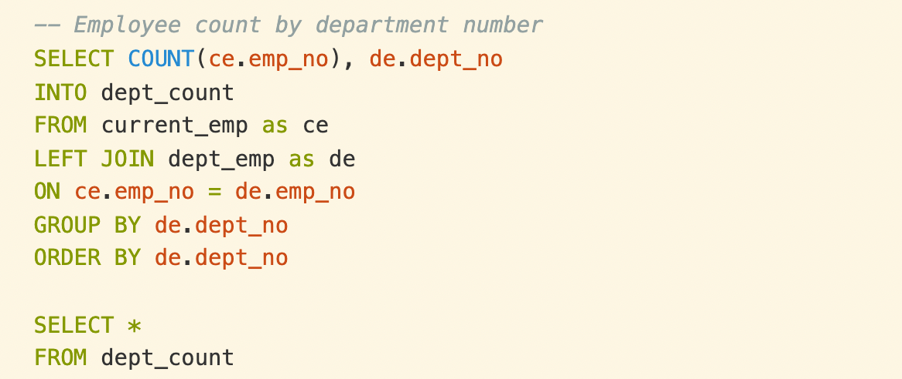
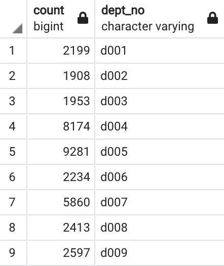
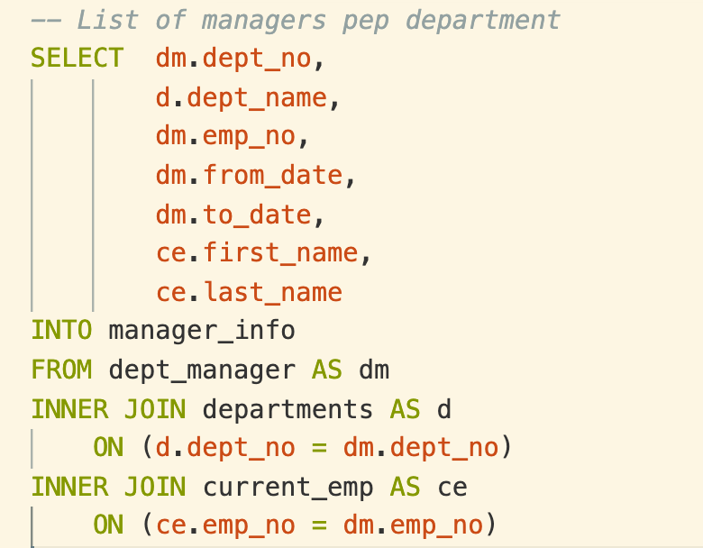
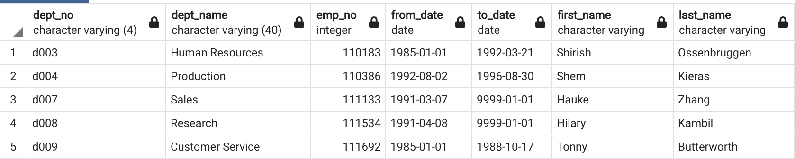

# Pewlett-Hackard-Analysis

## Overview of the analysis
This analysis will help Pewlett Hackard generate a list of all employees eligible for the retirement package and suggestions to decide the future required filled position. The process to build the analysis is based on six CSV files using SQL to create the employees' database, including the data modelling, data engineer, and data analysis skills.

## Results: Provide a bulleted list with four major points from the two analysis deliverables. Use images as support where needed.

* There is a total of 72,458 employees considering retiring soon. The highest retiring position is senior engineers with 25,916 people.
* The second-highest company future demand is senior staff positions with 24,926 people.

* Only 1,549 qualified employees include in the mentorship project. 
* Pewlett-Hackard is likely to prepare more than 80,000 positions to fulfill the plan in the following days, especially in senior positions. 

## Summary: Provide high-level responses to the following questions, then provide two additional queries or tables that may provide more insight into the upcoming "silver tsunami."

1. How many roles will need to be filled as the "silver tsunami" begins to make an impact?
72,458 people will retire soon, and only 1,549 are qualified with the mentorship project. Therefore, there are more than 70,909 will need to be quickly fulfilled. 

2. Are there enough qualified, retirement-ready employees in the departments to mentor the next generation of Pewlett Hackard employees?
No. Only 1,549 retiring employees can go to the next generation. 

### Additional queries
1. Using the following query, we can figure out the number of employees in each department. It implies that the company's most prominent department is the Development Department to fulfill it first.

2.Using the query to join the managers' names with their departments helps the opening position plan efficiently assign to the exact person and push the movement. 

